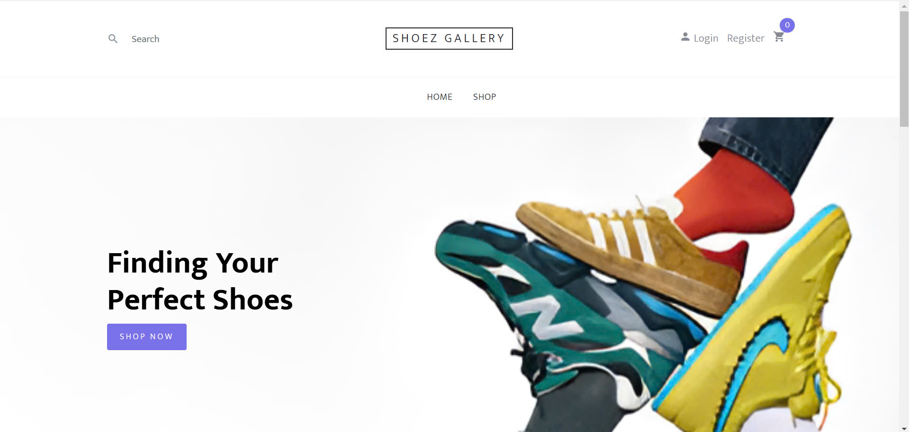
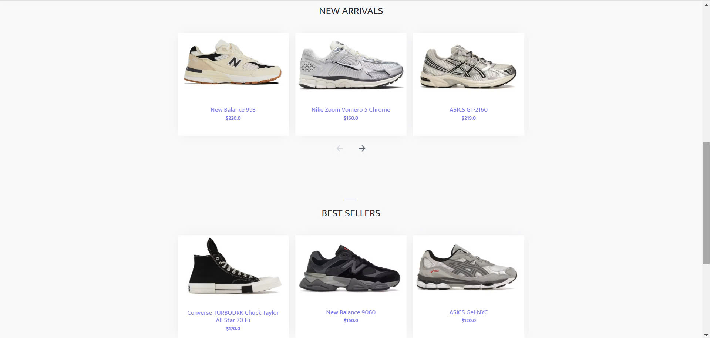
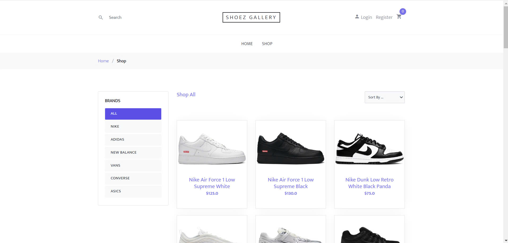

# Shoez Gallery

## Screenshots 

## Technology 
- **JSP/Servlet**
- **SQL Server**

## Description
Shoez Gallery is an e-commerce website designed for selling shoes online. It provides a platform for users to browse and purchase shoes, while also offering an admin page to manage products, users, and orders efficiently.

### Prerequisites
- Java (JDK 17 or later)
- Apache Tomcat 10.1
- SQL Server 2019
